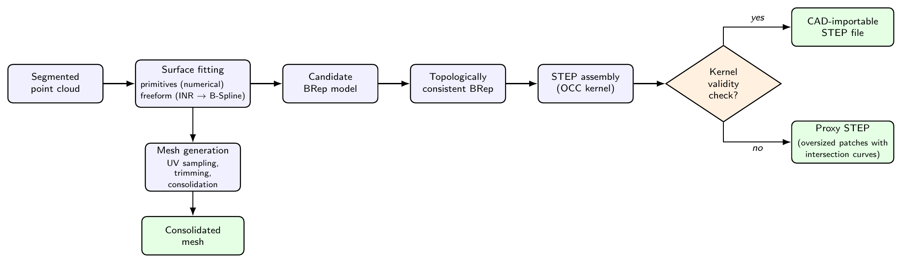
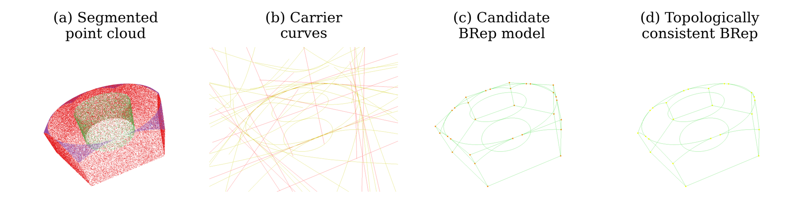
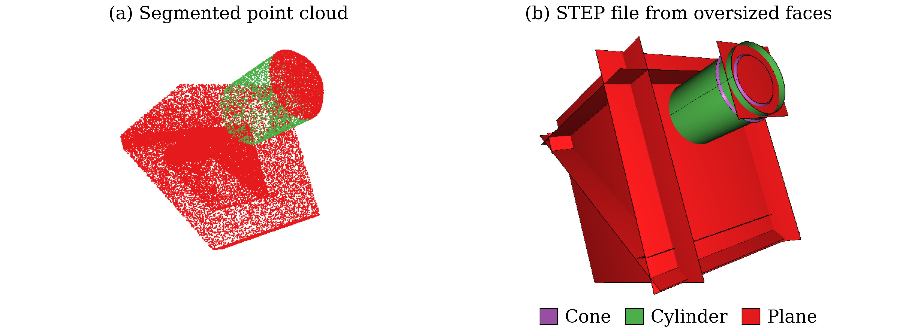
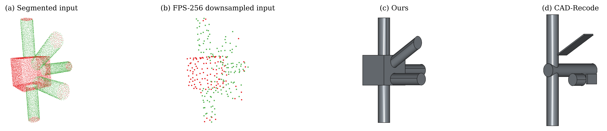

# Point2STEP

Code for our Point2STEP paper (still awaiting acceptance) - an optimized version of Point2CAD ([paper](https://arxiv.org/abs/2312.04962), [code](https://github.com/prs-eth/point2cad)) that additionally produces CAD-importable STEP files for segmented 3D point clouds. It fits a surface to every segment, computes the pairwise intersection curves analytically, enumerates candidate vertices and edges, and enforces topological consistency of the resulting BRep with an integer linear program before handing the model to the OpenCASCADE kernel for STEP export. When the exported file fails CAD kernel-level validity, it falls back to a proxy STEP representation that has to be handled manually via CAD TRIM operations.

<figure>
  <figcaption><em>Pipeline overview.</em></figcaption>
  
</figure>

<figure>
  <figcaption><em>Overview of a successful run.</em></figcaption>
  
</figure>

<figure>
  <figcaption><em>When strict STEP file generation fails, we generate a proxy representation which is CAD kernel-level valid, but requires manual handling via CAD TRIM operations.</em></figcaption>
  
</figure>

This repository holds everything needed to reproduce the published results, as well as run both the mesh and STEP pipelines.

## Contents

- [Repository layout](#repository-layout)
- [Installation](#installation)
- [Usage](#usage)
  - [Visualization from inside a container](#visualization-from-inside-a-container)
  - [Coordinate spaces](#coordinate-spaces)
  - [Evaluation metrics](#evaluation-metrics)
- [Dataset](#dataset)
  - [Bundled samples](#bundled-samples)
  - [ABCParts](#abcparts)
- [Reproducing the evaluation](#reproducing-the-evaluation)
  - [Reference metrics](#reference-metrics)
- [Baselines](#baselines)
  - [Point2CAD](#point2cad)
  - [CAD-Recode](#cad-recode)
- [Citation](#citation)

## Repository layout

```
point2step/                  the package: fitting, intersection, topology, ...
mesh_pipeline.py             mesh generation pipeline
step_pipeline.py             STEP file generation pipeline
proxy_step_pipeline.py       proxy STEP file generation pipeline
sample_clouds/               ready-to-run input clouds
docker/                      Docker-related files
evaluation/                  evaluation wrappers and aggregators
preprocessing/               ABCParts conversion and primitive/freeform classification
splits/                      ABCParts validation splits
reference_metrics/           aggregator outputs of the run the paper reports
point2cad_original/          the Point2CAD baseline
cadrecode/                   CAD-Recode comparison
```

## Installation

All three images build on CUDA base images and every command below passes `--gpus all`, so running these pipelines needs:

- an NVIDIA GPU of [compute capability](https://developer.nvidia.com/cuda-gpus) 5.0 to 9.0, Maxwell through Hopper
- an [NVIDIA driver](https://www.nvidia.com/en-us/drivers/), version per the table below
- the [NVIDIA Container Toolkit](https://docs.nvidia.com/datacenter/cloud-native/container-toolkit/latest/install-guide.html), which is what makes `--gpus all` work

No CUDA toolkit is needed on the host, since each image ships the CUDA runtime it needs. Check the driver version with `nvidia-smi`:

| Driver | Action |
| --- | --- |
| 560.28.03 or newer | use the plain `docker run` commands below |
| 525.60.13 to 560.28.03 | use the `NVIDIA_DISABLE_REQUIRE=1` variant below |
| older than 525.60.13 | update the driver to 525.60.13 or newer |

Three Docker images are related to this codebase:

| Image | Dockerfile | Runs |
| --- | --- | --- |
| `point2step` | `docker/point2step.dockerfile` | the pipelines, `evaluation/`, `preprocessing/` |
| `point2cad_original` | `docker/point2cad_original.dockerfile` | the Point2CAD baseline in `point2cad_original/` |
| `cadrecode` | `docker/cadrecode.dockerfile` | the CAD-Recode comparison in `cadrecode/` |

`docker/` is a self-sufficient build context, so each image builds from that directory alone:

```bash
docker build -f docker/point2step.dockerfile -t point2step docker/

docker build -f docker/point2cad_original.dockerfile -t point2cad_original docker/

docker build -f docker/cadrecode.dockerfile -t cadrecode docker/
```

## Usage

[mesh_pipeline.py](./mesh_pipeline.py) produces a mesh for a given segmented point cloud, and [step_pipeline.py](./step_pipeline.py) tries to produce a CAD kernel-level valid STEP file. In the event that `step_pipeline.py` fails, [proxy_step_pipeline.py](./proxy_step_pipeline.py) produces the proxy representation instead. All three read their input from `{input_dir}/{model_id}/*.xyzc`, the format [Dataset](#dataset) describes. Each such file is one part of the model, and its name has to be an integer - `0.xyzc`, `1.xyzc` and so on - because that number is what orders the parts. All three run in the `point2step` image.

There are two ways to invoke them. The first spawns a container that runs a single pipeline and is removed once the run finishes:

```bash
# driver 560.28.03 or newer
docker run --rm --gpus all -v "$PWD":/work -w /work point2step \
    python step_pipeline.py --input_dir sample_clouds --model_id abc_00949

# driver 525.60.13 to 560.28.03
docker run --rm --gpus all -e NVIDIA_DISABLE_REQUIRE=1 -v "$PWD":/work -w /work point2step \
    python step_pipeline.py --input_dir sample_clouds --model_id abc_00949
```

The second spawns an interactive shell, from which the pipelines are invoked directly. This is the more convenient form when several runs follow each other, and the one to use with `--visualize`, covered in [visualization from inside a container](#visualization-from-inside-a-container):

```bash
# driver 560.28.03 or newer
docker run --rm -it --gpus all -v "$PWD":/work -w /work point2step bash

# driver 525.60.13 to 560.28.03
docker run --rm -it --gpus all -e NVIDIA_DISABLE_REQUIRE=1 -v "$PWD":/work -w /work point2step bash

# then, from the shell of the container
python mesh_pipeline.py --input_dir sample_clouds --model_id abc_00949
python step_pipeline.py --input_dir sample_clouds --model_id abc_00949
python proxy_step_pipeline.py --input_dir sample_clouds --model_id abc_00949
```

Both mount the repository at `/work` and work from there, which is also the repository root, so every path default resolves relative to it. The entrypoint creates a user matching the owner of the mounted directory, so outputs land on the host with the right ownership, and `DEBUG=1` makes it print a CUDA and OpenCASCADE sanity check before handing over.

Each pipeline writes to `{output_dir}/{model_id}/`, defaulting to `output_mesh`, `output_step` and `output_proxy_step` respectively. The complete model is written to:

```
output_mesh/{model_id}/unified/trimmed.stl     the mesh
output_step/{model_id}/unified/unified.step    the STEP file
output_proxy_step/{model_id}/unified/proxy.step  the proxy STEP file
```

Everything else under `{output_dir}/{model_id}/` is written per input file and per fitted surface.

### Visualization from inside a container

`--visualize` opens Open3D windows, which need a display server the container can reach. Allow local connections once per host session, then forward the display into the container:

```bash
xhost +local:docker

# driver 560.28.03 or newer
docker run --rm -it --gpus all \
    -v "$PWD":/work -w /work \
    -e DISPLAY=$DISPLAY -v /tmp/.X11-unix:/tmp/.X11-unix \
    -e NVIDIA_DRIVER_CAPABILITIES=all \
    -e __NV_PRIME_RENDER_OFFLOAD=1 \
    -e __GLX_VENDOR_LIBRARY_NAME=nvidia \
    point2step bash

# driver 525.60.13 to 560.28.03
docker run --rm -it --gpus all \
    -v "$PWD":/work -w /work \
    -e DISPLAY=$DISPLAY -v /tmp/.X11-unix:/tmp/.X11-unix \
    -e NVIDIA_DRIVER_CAPABILITIES=all \
    -e NVIDIA_DISABLE_REQUIRE=1 \
    -e __NV_PRIME_RENDER_OFFLOAD=1 \
    -e __GLX_VENDOR_LIBRARY_NAME=nvidia \
    point2step bash
```

An interactive shell is the convenient form here, since the visualizers are meant to be opened and closed repeatedly.

### Coordinate spaces

Every pipeline normalizes the input cloud before processing, so all operations are conducted in the normalized space. The normalization algorithm is not trivial and we will not expose all the details here, but it essentially boils down to an affine transformation, and applying its inverse moves the result back into the coordinate space of the input cloud, the world space. All three pipelines do this before writing the output, so the STEP files and the mesh are represented in the input coordinate space. Applying the inverse increases the interpretability of obtained metrics. The evaluation, however, keeps everything in the normalized space, so that models of different input scales can be aggregated.

### Evaluation metrics

Both pipelines score their result against the input cloud. **Coverage metrics** measure how much of the input the reconstruction accounts for, **fidelity metrics** how far the reconstruction sits from the input.

[mesh_pipeline.py](./mesh_pipeline.py):

- coverage: point cloud to mesh coverage (P2M), mesh to point cloud coverage (M2P)
- fidelity: residual mean, mesh Chamfer distance

[step_pipeline.py](./step_pipeline.py):

- coverage: point cloud to STEP coverage (P2S)
- fidelity: one-sided Chamfer distance (OCD)

`step_pipeline.py` produces several candidate STEP files for one input and keeps the one with the highest P2S, with OCD as a tiebreaker. `--selection_frame` picks the space that choice is made in, the default mode is normalized.

## Dataset

The pipelines consume `.xyzc` files, four whitespace-separated columns of `x y z segment_id`. Segmentation is expected at the input, and is not something this pipeline computes.

`--input_dir` defaults to `sample_clouds_abc_parts`, the directory the ABCParts converter below writes, so anything else has to be passed explicitly.

### Bundled samples

`sample_clouds/` contains test segmented point clouds. Running the [usage](#usage) commands on any of them, by passing its name as `--model_id`, is the quickest way to make sure everything is in order before feeding your data.

### ABCParts

Every reported number comes from ABCParts, released by the authors of HPNet ([paper](https://arxiv.org/abs/2105.10620), [code](https://github.com/SimingYan/HPNet)). In order to reproduce the results, first download the dataset locally (if you are not interested in reproducing the results, you can skip this section entirely):

- **ABCParts**: https://drive.google.com/file/d/1qH-1A8p3jDtTxS2i-423AZTjiBu9RGL1/view

The archive holds `.h5` files that must be converted into the layout above. Point `--data_dir` at the directory you unpacked them into:

```bash
python preprocessing/convert_abc_parts.py --data_dir <path_to_ABCParts>
```

This writes `sample_clouds_abc_parts/{model_id}/0.xyzc` at the repository root, which is where every pipeline looks by default. Use `--output_dir` to put it somewhere else, and pass the same path as `--input_dir` to the pipelines appropriately.

`splits/val_primitives.txt` (3110 models) and `splits/val_freeform.txt` (847 models) are the validation splits the evaluation wrappers read, and they ship with the repository. They are produced by `preprocessing/classify_abc_parts.py`, which runs only the surface fitting engine: a model is **primitive** when every one of its segments is fitted by a primitive surface, and **freeform** as soon as one segment is not.

## Reproducing the evaluation

```bash
python evaluation/run_mesh_eval.py --primitive_ids splits/val_primitives.txt \
    --freeform_ids splits/val_freeform.txt

python evaluation/run_step_eval.py --primitive_ids splits/val_primitives.txt \
    --freeform_ids splits/val_freeform.txt
```

Both read `sample_clouds_abc_parts` by default, and both run one model at a time.

Running the mesh evaluation first saves time but is not required. Each wrapper runs a primitive phase over `--primitive_ids` and a freeform phase over `--freeform_ids`, and both phases are needed for a complete `summary.json`. The freeform half of `run_step_eval.py` compares every neural freeform surface against its B-spline conversion, reusing the neural networks trained by the surface fitting stage of `run_mesh_eval.py`. On a cache miss it trains them from scratch.

Finally, the aggregators turn those runs into the published results:

```bash
python evaluation/aggregate_mesh_eval.py --dir_orig point2cad_original/output_p2cad_orig
python evaluation/aggregate_step_eval.py
```

Each aggregator prints the tables the paper reports and writes the same numbers to a `summary.json`, in `aggregator_mesh_output/` and `aggregator_step_output/` respectively. `aggregate_mesh_eval.py` prints the mesh quality and execution time tables for the primitive class, the freeform class, and globally aggregated results. `aggregate_step_eval.py` prints the model type breakdown, the coverage and one-sided Chamfer distance distributions, and the INR to B-Spline conversion table, and additionally writes the two boxplots to `aggregator_step_output/figures/`. `--dir_orig` is where the [Point2CAD baseline](#point2cad) wrote its results, and the mesh comparison is paired: every metric it reports is computed on the models both methods completed, so the baseline has to be run before the mesh results can be aggregated.

### Reference metrics

`reference_metrics/` holds the two `summary.json` files from our own run, so a reproduction can be compared against the published numbers directly:

```
reference_metrics/aggregator_mesh_output/summary.json
reference_metrics/aggregator_step_output/summary.json
```

## Baselines

### Point2CAD

`point2cad_original/` is the upstream Point2CAD working tree that produced the baseline numbers. The algorithm itself is unchanged, so the baseline is the published method - our changes are input and output wiring, so that both sides can be run over a whole split and scored by the same code. Diffing the directory against [upstream](https://github.com/prs-eth/point2cad) shows the full extent of it.

`run_abc_parts.py`, at the root of that directory, is the equivalent of our evaluation wrappers: it reads a split file and runs the baseline over every model in it. Run it from inside `point2cad_original/`:

```bash
# driver 560.28.03 or newer
docker run --rm --gpus all -v "$PWD":/work -w /work/point2cad_original point2cad_original \
    python run_abc_parts.py --ids_file ../splits/val_primitives.txt \
    --input_dir ../sample_clouds_abc_parts

# driver 525.60.13 to 560.28.03
docker run --rm --gpus all -e NVIDIA_DISABLE_REQUIRE=1 -v "$PWD":/work -w /work/point2cad_original point2cad_original \
    python run_abc_parts.py --ids_file ../splits/val_primitives.txt \
    --input_dir ../sample_clouds_abc_parts
```

Results land in `point2cad_original/output_p2cad_orig/`, which is the default for `mesh_pipeline.py --orig_dir` and the path to give `aggregate_mesh_eval.py --dir_orig`.

### CAD-Recode

CAD-Recode ([paper](https://arxiv.org/abs/2412.14042), [code](https://github.com/filaPro/cad-recode)) uses a decoder transformer neural network architecture to predict a sequence of sketch/extrude operations from the given point cloud (segmentation is not required), and is one of the few published methods that also produces a STEP file. The maximum resolution it can process is 256 points, so any point cloud in production must be downsampled first. We did not perform a detailed quantitative comparison, but because of the necessity of downsampling, we hypothesize that CAD-Recode, and in general algorithms with limited input resolution, are not feasible in practice because of the information loss downsampling induces. The following figure illustrates this phenomenon:

<figure>
  
  <figcaption><em>The same input cloud through both methods, at the resolution each of them accepts.</em></figcaption>
</figure>

The `cadrecode/` module is there for anyone who wants to take this comparison further - it runs in its own image. `cadrecode/main.py` downsamples an input cloud to 256 points by farthest point sampling, runs the model, and exports the STEP file its generated CadQuery script produces.

Everything is pulled from the Hugging Face Hub: the weights from `filapro/cad-recode-v1.5`, and the tokenizer from `Qwen/Qwen2-1.5B`, the base model CAD-Recode is built on. `cadrecode/main.py` passes an access token to both. Put it in `secrets.yaml` at the repository root:

```yaml
HF_TOKEN: hf_your_token_here
```

```bash
# driver 560.28.03 or newer
docker run --rm -t --gpus all -v "$PWD":/work -w /work cadrecode \
    python cadrecode/main.py --input_path sample_clouds/abc_00949/0.xyzc

# driver 525.60.13 to 560.28.03
docker run --rm -t --gpus all -e NVIDIA_DISABLE_REQUIRE=1 -v "$PWD":/work -w /work cadrecode \
    python cadrecode/main.py --input_path sample_clouds/abc_00949/0.xyzc
```

`--input_path` chooses the cloud, and defaults to `sample_clouds/abc_00949/0.xyzc`, the model of the figure above. Any whitespace-separated text file whose first three columns are `x y z` works, and a segmentation column is ignored where there is one, since CAD-Recode does not consume a segmentation.

Each run writes to `output_cadrecode/{name}/`, where `{name}` is the name of the input file, prefixed with the name of its parent directory. `generated.py` is the CadQuery script the model produced and `generated.step` the STEP file exported from it, next to the full and the downsampled cloud the run consumed.

## Citation
```bibtex
@article{point2step,
  title   = {Point2STEP: From Point Clouds to STEP files via Topologically Consistent BRep models},
  author  = {Utješinović, Luka and Jovančević, Igor and Došljak, Velibor and Orteu, Jean-José and Brault, Romain},
  year    = {2026},
  note    = {Under review}
}
```

`point2cad_original/` is the upstream Point2CAD project and stays under its own Apache-2.0 licence.
